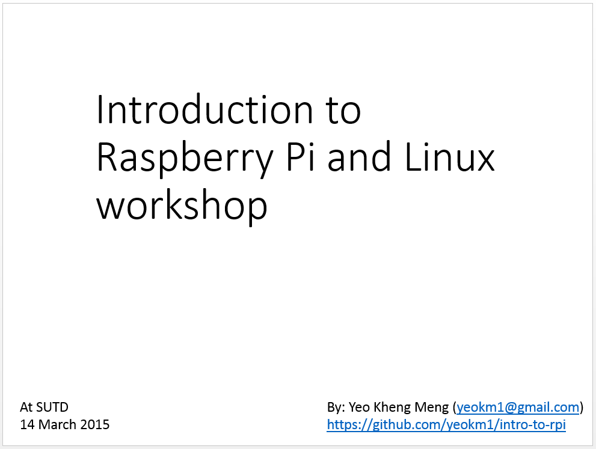

# Introduction to Raspberry Pi and Linux
A short introductory course I conducted for people new to Raspberry Pis and Linux. My slides are available on slideshare in the picture link below.

#Parts Required
1x of each unless otherwise stated

1. Raspberry Pi (any model)
2. Micro-SD card flashed with Raspbian
3. Micro-USB cable and/or with power adapter
4. Small Breadboard
5. LED
6. Push button
7. 220-ohm Resistor
8. 4 male-female jumper wires
9. LAN cable

#Software required:

SSH client on computer connected to same subnet as Raspberry Pi. Mac/Linux normally comes with an SSH client by default. Windows users can download the [Putty installer](http://www.chiark.greenend.org.uk/~sgtatham/putty/download.html).

#Hardware Connection:

